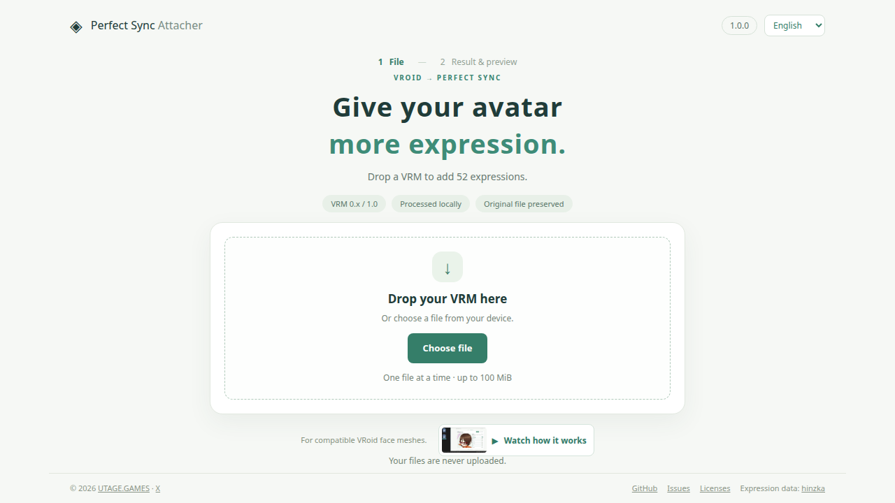

# Perfect Sync Attacher

[日本語](README.md) | English

A web app that adds 52 Perfect Sync expressions to compatible VRoid Studio VRM models. No Unity setup is required: drop a VRM, check the expressions, and save the converted file.

Release version: `1.1.0`. The [public app](https://perfectsync.utage.games/) is hosted on Cloudflare Pages.



## Usage

1. Drop a VRM file or choose it from your device.
2. Check the converted model in the 3D preview. Adjust expressions with sliders, drag to rotate, and scroll to zoom.
3. Select **Save VRM** to download a file with `_perfectsync` added to its original name.

The original file is preserved. Preview slider values are not baked into the saved VRM. The interface supports Japanese, English, Korean, Traditional Chinese, and Simplified Chinese; switch languages in the header.

## Supported models and limitations

- VRM 0.x and 1.0 are supported. Output keeps the input format; this app does not convert between VRM versions.
- The face mesh must be compatible with the template. Not every VRoid model is supported.
- Merged face/body meshes, incompatible UV or vertex correspondence and triangle structure, and external buffer/image references are unsupported.
- Conflicting existing Perfect Sync expressions stop conversion. Files already converted by this tool are returned unchanged.
- Process one file at a time, up to 100 MiB. Internal data and face meshes have additional processing limits.
- Expressions use a simple adjustment fitted to the face shape. Check the lips, teeth, eyelids, tongue, and combined expressions for unwanted intersections.

Local validation converted 8 of 10 models, with zero glTF validation errors in supported outputs. Operation in WebcamMotionCapture / VSeeFace has not been verified. Use VRM 0.x for VSeeFace. See the [prototype guide](docs/prototype-guide.md) (Japanese) for details.

## Privacy

Conversion and preview run on your device. Input models are not uploaded. The app and expression template are fetched from the serving site. Deployments configured with `GTM_ID` start Google Analytics only after consent. No tags load before consent or after refusal. Analytics are used to count visits; application actions are not tracked. Choices are saved for 90 days and can be withdrawn from the footer. Your interface language is also stored in the browser.

## Development

Use Node.js 22.12 or later.

```sh
npm ci
npm run dev
```

Open the local URL shown in the terminal.

```sh
npm test                # Engine, translation and language preference tests
npm run test:e2e        # Chrome interaction tests
npm run test:analytics  # Consent and network tests using a local Google tag stub
npm run build          # Generate dist/ for Cloudflare Pages
npm run preview        # Preview the production build
```

Browser tests use a local Chrome installation and private test models. Models are not included in this repository. See the [prototype guide](docs/prototype-guide.md) and [local model notes](docs/local-model-inspection.md) (Japanese) for the required fixtures and setup. Set `PLAYWRIGHT_CHROME_PATH` to use a different Chrome path.

For Cloudflare Pages, use `npm run build` and the output directory `dist`. No conversion API or model storage is required. To enable analytics, set the Cloudflare build variable `GTM_ID` and configure GTM / GA4 following the [consent setup guide](docs/analytics-and-consent.md) (Japanese). See the [publication settings](docs/seo-and-publication.md) (Japanese) for the public URL, localized pages, and search metadata. See [docs/README.md](docs/README.md) (Japanese) for the design and development conventions.

## Contact

For bug reports, requests, and questions, use the [contact form](https://tally.so/r/KYqY78?product=PerfectSync%20Attacher). [GitHub Issues](https://github.com/utagestudio/perfectsync_attacher/issues) are also available.

For bug reports, include the app and browser versions, VRM version, steps to reproduce, and displayed error. Do not attach VRM files, confidential information, or images you are not authorized to publish.

## License and credits

The application code is licensed under [MIT](LICENSE). The expression template is based on [hinzka's 52blendshapes-for-VRoid-face](https://github.com/hinzka/52blendshapes-for-VRoid-face). Third-party libraries and templates retain their respective terms. See the [license notes](docs/licenses.md) (Japanese).
